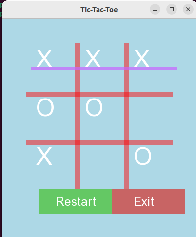

# Tic-Tac-Toe (C++ with SFML)

A simple graphical Tic-Tac-Toe game built using C++ and the SFML (Simple and Fast Multimedia Library). The game provides a basic user interface, supports two players, and includes options to restart or exit.

## Features
- Classic 3x3 Tic-Tac-Toe gameplay
- Two-player mode (X and O)
- Graphical interface using SFML
- Restart and Exit buttons
- Win detection

## Technologies Used
- C++
- SFML (Simple and Fast Multimedia Library)

## Installation and Setup

### 1. Install SFML (Ubuntu)
```bash
sudo apt update
sudo apt install libsfml-dev

g++ task6.cpp -o tictactoe -lsfml-graphics -lsfml-window -lsfml-system

./tictactoe

tictactoe/
│── task6.cpp
│── README.md



Author
Aleesha-10 <3
